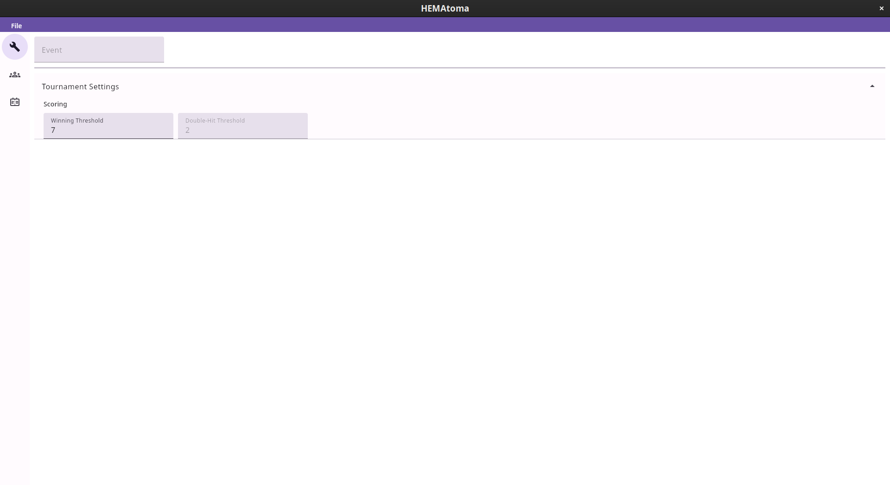
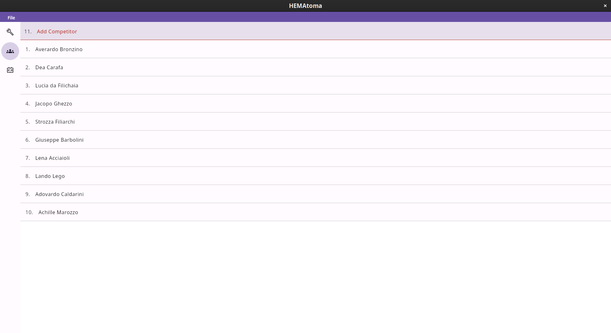
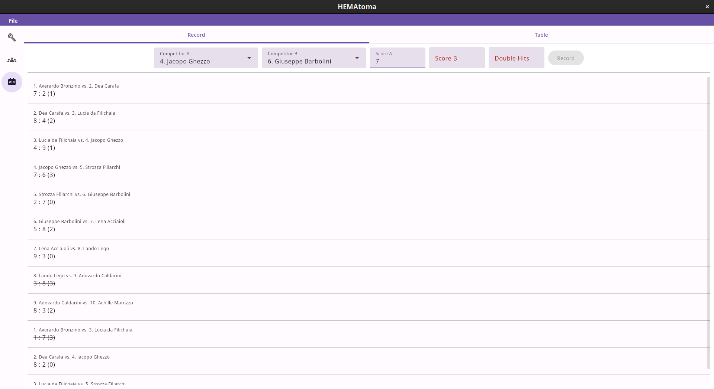
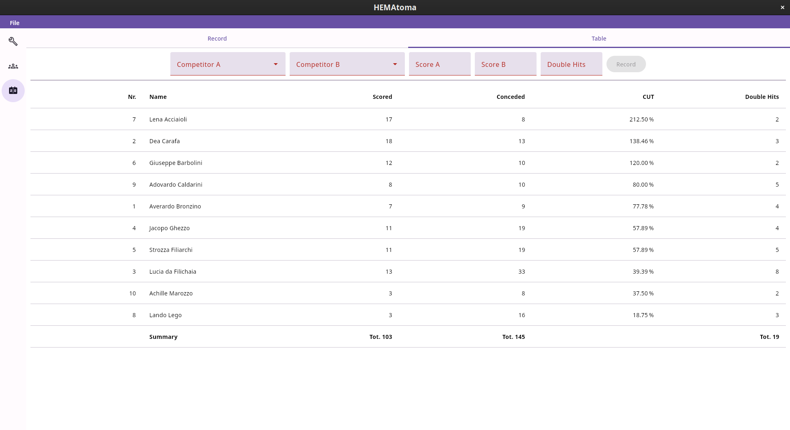
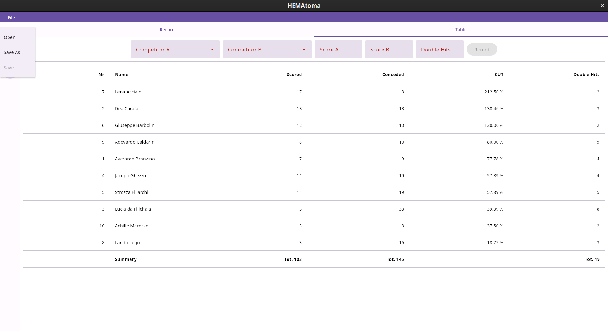

# HEMAtoma

HEMAtoma is a tournament planner / helper for tournaments held by the club 'Fior della Spada'.
It supports the rules / scoring according to the rules on their [homepage](https://www.marozzo.info/torneo-di-bara/).

Screenshots

